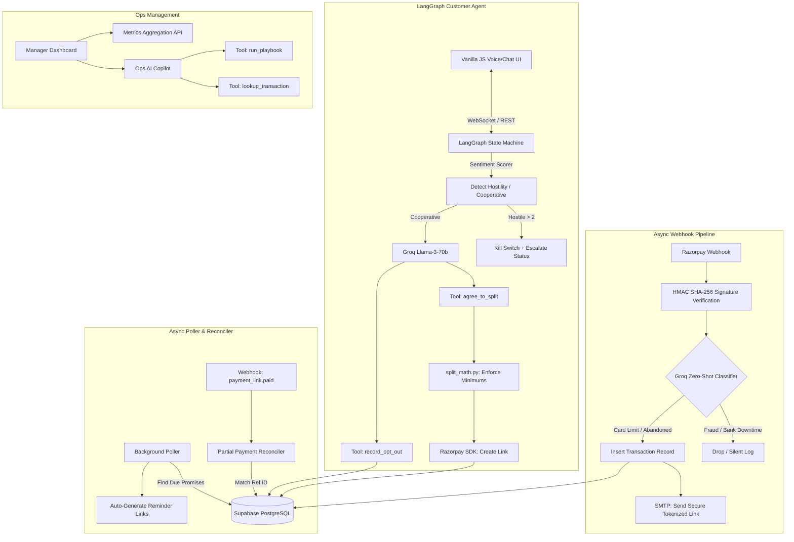

# 🌊 Recoup AI

**Razorpay Buildathon 2026 — Track 03: AI Revenue Recovery**

> *Revenue loss doesn't happen in one clean step. Recoup ensures recovery isn't just a blind retry, but an intelligent, bounded, and conversational intervention.*

[](#) 


---

## 🎯 Target Users

Recoup is designed to recover revenue for high-volume, modern businesses:
*   **SaaS & Subscription Platforms:** Businesses suffering from involuntary churn due to degraded auto-debits, mandate failures, or expired cards.
*   **B2B Enterprises & Marketplaces:** Finance teams chasing overdue high-ticket receivables who need a smart agent to negotiate partial payments rather than just sending static reminders.
*   **E-Commerce Brands:** Platforms dealing with high-value checkout drop-offs where standard dunning emails are ignored.
*   **Revenue & Ops Teams:** Internal collections managers who need a Copilot to autonomously execute recovery playbooks and maintain absolute audit visibility.


## 🎯 The Vision (Track 03 Alignment)
Razorpay handles millions of transactions, but when a payment degrades, a subscription fails, or a B2B invoice goes overdue, the standard response is static: generic emails or blind automated retries.

**Recoup AI** is an autonomous, multi-agent revenue recovery system that detects revenue at risk, diagnoses the root cause, and executes a strictly bounded recovery workflow. 

**I didn't just build a chatbot.** I built a secure state machine that features **measured money recovery, compliant escalation, absolute stopping rules, and a cryptographic audit trail**—hitting the exact bar required for Track 03.

---

## ✨ Key Features & Capabilities

### 🗣️ 1. Native Hinglish Voice & Text Recovery
An autonomous Customer Agent that reaches out to users via a secure tokenized link. It dynamically switches languages based on the user's prompt (e.g., natively responding in Hindi/Hinglish when the user says *"mere paas paise nahi hai"*). It supports full **Voice Mode** with low-latency TTS/STT pipelines.

### 🤝 2. "Promise-to-Pay" Engine (Partial Reconciliation)
If a customer cannot pay a ₹10,000 failed invoice, the agent negotiates a split payment. 
*   The agent dynamically asks the user how much they can afford to pay right now, and generates an immediate Razorpay link for that upfront amount (e.g., ₹2,000).
*   It schedules a *Promised Leg* for the remainder (₹8,000) on an agreed-upon future date.
*   **Background Poller:** Automatically tracks due dates and sends T-2 day reminders with fresh payment links.
*   **Webhooks Reconciler:** Listens to `payment_link.paid` events and accurately credits partial amounts to the original transaction ID.

### 🛑 3. Ironclad Guardrails & Stopping Rules
LLMs are unpredictable; payments cannot be. Recoup enforces strict state-machine guardrails:
*   **Hostility Gates:** A lightweight sentiment scorer evaluates every message. If a customer is abusive or hostile twice, the AI is short-circuited, the chat is locked, and the ticket is escalated to a human reviewer and the collections team.
*   **Opt-Outs:** Saying "Stop contacting me" triggers the `record_opt_out` tool, instantly killing the recovery link (HTTP 410 Gone) and halting all scheduled reminders.
*   **Math Bounds:** Splitting payments enforces minimum thresholds (₹50).
*   **Promise Locks:** Once a customer commits to a payment plan, the AI is structurally stripped of its negotiation tools. Prompt-injection attempts to renegotiate are physically impossible.

### 📊 4. Ops Console & AI Manager
A dedicated Dashboard and Copilot for internal Ops Managers. 
*   View real-time metrics: Amount Pending, Total Recovered, Risk Categories.
*   Chat with the Ops Agent to pull up raw audit trails for specific transactions.
*   Command the AI to autonomously execute playbooks (e.g., *"Run the broken_promise playbook on transaction XYZ"*), which sends emails and creates standalone untracked links that dynamically sync back to the dashboard.

---

## 🧠 System Architecture



[📥 **Download High-Res Architecture PNG**](https://mermaid.ink/img/eyJjb2RlIjogImdyYXBoIFREXG4gICAgJSUgQ29yZSBJbmdlc3Rpb24gJiBSb3V0aW5nXG4gICAgc3ViZ3JhcGggQXN5bmMgV2ViaG9vayBQaXBlbGluZVxuICAgICAgICBXSFtSYXpvcnBheSBXZWJob29rXSAtLT4gVmVyaWZ5W0hNQUMgU0hBLTI1NiBTaWduYXR1cmUgVmVyaWZpY2F0aW9uXVxuICAgICAgICBWZXJpZnkgLS0-IFJvdXRlcntHcm9xIFplcm8tU2hvdCBDbGFzc2lmaWVyfVxuICAgICAgICBSb3V0ZXIgLS0-fEZyYXVkIC8gQmFuayBEb3dudGltZXwgSWdub3JlW0Ryb3AgLyBTaWxlbnQgTG9nXVxuICAgICAgICBSb3V0ZXIgLS0-fENhcmQgTGltaXQgLyBBYmFuZG9uZWR8IFR4W0luc2VydCBUcmFuc2FjdGlvbiBSZWNvcmRdXG4gICAgICAgIFR4IC0tPiBFbWFpbFtTTVRQOiBTZW5kIFNlY3VyZSBUb2tlbml6ZWQgTGlua11cbiAgICBlbmRcblxuICAgICUlIEN1c3RvbWVyIEFJIEdyYXBoXG4gICAgc3ViZ3JhcGggTGFuZ0dyYXBoIEN1c3RvbWVyIEFnZW50XG4gICAgICAgIFVJW1ZhbmlsbGEgSlMgVm9pY2UvQ2hhdCBVSV0gPC0tPnxXZWJTb2NrZXQgLyBSRVNUfCBTdGF0ZVtMYW5nR3JhcGggU3RhdGUgTWFjaGluZV1cbiAgICAgICAgU3RhdGUgLS0-fFNlbnRpbWVudCBTY29yZXJ8IE5MUFtEZXRlY3QgSG9zdGlsaXR5IC8gQ29vcGVyYXRpdmVdXG4gICAgICAgIE5MUCAtLT58SG9zdGlsZSA-IDJ8IEVzY2FsYXRlW0tpbGwgU3dpdGNoICsgRXNjYWxhdGUgU3RhdHVzXVxuICAgICAgICBOTFAgLS0-fENvb3BlcmF0aXZlfCBMTE1bR3JvcSBMbGFtYS0zLTcwYl1cbiAgICAgICAgXG4gICAgICAgIExMTSAtLT4gVG9vbDFbVG9vbDogYWdyZWVfdG9fc3BsaXRdXG4gICAgICAgIExMTSAtLT4gVG9vbDJbVG9vbDogcmVjb3JkX29wdF9vdXRdXG4gICAgICAgIFxuICAgICAgICBUb29sMSAtLT4gTWF0aEd1YXJkW3NwbGl0X21hdGgucHk6IEVuZm9yY2UgTWluaW11bXNdXG4gICAgICAgIE1hdGhHdWFyZCAtLT4gUnpwQVBJW1Jhem9ycGF5IFNESzogQ3JlYXRlIExpbmtdXG4gICAgZW5kXG5cbiAgICAlJSBCYWNrZ3JvdW5kIFdvcmtlcnMgJiBTeW5jXG4gICAgc3ViZ3JhcGggQXN5bmMgUG9sbGVyICYgUmVjb25jaWxlclxuICAgICAgICBEQlsoU3VwYWJhc2UgUG9zdGdyZVNRTCldXG4gICAgICAgIENyb25bQmFja2dyb3VuZCBQb2xsZXJdIC0tPnxGaW5kIER1ZSBQcm9taXNlc3wgREJcbiAgICAgICAgQ3JvbiAtLT4gQXV0b0xpbmtbQXV0by1HZW5lcmF0ZSBSZW1pbmRlciBMaW5rc11cbiAgICAgICAgXG4gICAgICAgIFN1Y2Nlc3NXSFtXZWJob29rOiBwYXltZW50X2xpbmsucGFpZF0gLS0-IFJlY29uY2lsZVtQYXJ0aWFsIFBheW1lbnQgUmVjb25jaWxlcl1cbiAgICAgICAgUmVjb25jaWxlIC0tPnxNYXRjaCBSZWYgSUR8IERCXG4gICAgZW5kXG5cbiAgICAlJSBPcHMgQ29uc29sZVxuICAgIHN1YmdyYXBoIE9wcyBNYW5hZ2VtZW50XG4gICAgICAgIE9wc1VJW01hbmFnZXIgRGFzaGJvYXJkXSAtLT4gU3RhdHNbTWV0cmljcyBBZ2dyZWdhdGlvbiBBUEldXG4gICAgICAgIE9wc1VJIC0tPiBPcHNMTE1bT3BzIEFJIENvcGlsb3RdXG4gICAgICAgIE9wc0xMTSAtLT4gUGxheWJvb2tzW1Rvb2w6IHJ1bl9wbGF5Ym9va11cbiAgICAgICAgT3BzTExNIC0tPiBMb29rdXBbVG9vbDogbG9va3VwX3RyYW5zYWN0aW9uXVxuICAgIGVuZFxuXG4gICAgJSUgUmVsYXRpb25zXG4gICAgVHggLS0-IERCXG4gICAgUnpwQVBJIC0tPiBEQlxuICAgIFRvb2wyIC0tPiBEQiIsICJtZXJtYWlkIjogeyJ0aGVtZSI6ICJkZWZhdWx0In19?bgColor=ffffff)


---

## 🛠️ Tech Stack

*   **Backend:** FastAPI (Python 3.10+), Uvicorn
*   **AI & Orchestration:** LangGraph (Stateful Multi-Agent), LangChain, Groq (Llama-3-70b / GPT-OSS)
*   **Database:** PostgreSQL (Supabase) + `asyncpg` (Singleton Connection Pool)
*   **Voice/Audio:** Sarvam AI (Native Hinglish TTS), Whisper STT, Web Audio API
*   **Payments:** Razorpay API (Payment Links, Webhooks)
*   **Frontend:** Vanilla JS, HTML5, CSS3 (Lightweight, zero-build-step architecture)

---

## 🚀 How to Run Locally

1. **Clone & Install**
   ```bash
   git clone https://github.com/akhandpratap18/Razorpay-Buildathon.git
   cd "Razorpay Buildathon"
   python -m venv .venv
   source .venv/bin/activate
   pip install -r requirements.txt
   ```

2. **Environment Variables**
   Create a `.env` file based on `.env.example`:
   ```env
   DATABASE_URL=postgresql+asyncpg://...
   RAZORPAY_KEY_ID=rzp_test_...
   RAZORPAY_KEY_SECRET=...
   GROQ_API_KEY=gsk_...
   OPS_API_TOKEN=ops_dev_secret_123
   ```

3. **Run the Server**
   ```bash
   uvicorn app.main:app --reload --port 8000
   ```

4. **Background Workers** (In a separate terminal)
   ```bash
   python -m app.worker.poller
   ```

---
*Built with ❤️ for the Razorpay Buildathon 2026.*
